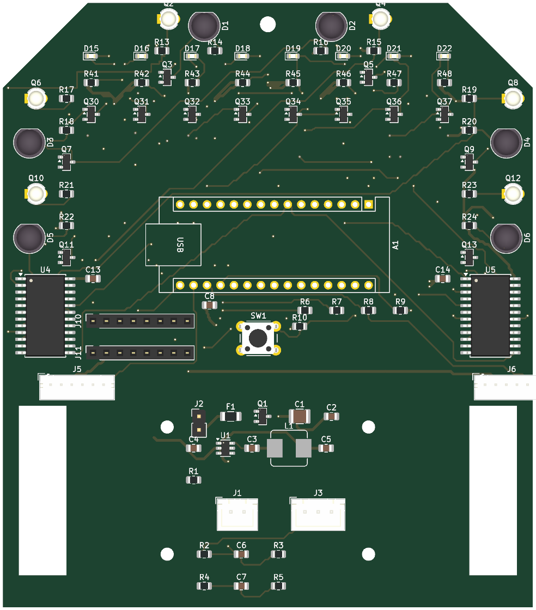

# Micromouse Runner

A micromouse robot built around a single **Arduino Nano ESP32** doing all
control and wireless telemetry, on a custom 4-layer KiCad 10 carrier PCB.



## The board (rev 2 — ESP32-only)

**100 × 128 mm**, 4 copper layers, drive wheels inside the outline via interior
slots, front castor. Rev 1 carried both an STM32 and an ESP32 (150 × 185 mm);
rev 2 dropped the STM32 entirely to shrink the board.

| Subsystem | Part | Mounting |
|---|---|---|
| Controller | Arduino Nano ESP32 (ESP32-S3) — control **and** telemetry | Socketed, real `Module:Arduino_Nano` land pattern |
| Motor driver | TB6612FNG breakout | Socketed (2× 1×8) |
| Motors | 2× N20 gearmotors + quadrature encoders (ESP32 PCNT hardware decode) | JST-PH connectors |
| Wall sensors | 6× SFH4550 / SFH309 IR pairs | THT, bent-lead, side-edge clusters |
| Line sensors | 8× SMD IR pairs, 9.525 mm QTR pitch | SMD, bottom face |
| Sensor readout | 2× HEF4067 16-ch analog mux/demux | one ADC pin reads all 14 sensors |
| Power | 2S LiPo → AP63203 buck → 3V3 | reverse-polarity P-FET, fuse, per-cell sense |

Design rules: 0.3 mm routing clearance so no trace runs between through-hole
pins (hand-solder safety), routed by the project's own 4-layer A* autorouter.
ERC 0 / DRC 0 errors as shipped.

## Repository layout

```
micromouse-runner/
├── pcb/            KiCad hardware design
│   ├── micromouse-pcb.kicad_sch / .kicad_pcb / .kicad_pro
│   ├── netlist.net
│   ├── CONNECTIONS.md      every net, every pin, and why (generated, coverage-enforced)
│   ├── PROJECT_NOTES.md    full design decision log, research, and known issues
│   └── tools/              generators (schematic + PCB are script-produced, so auditable)
│       ├── gen_sch.py / build_schematic.py     schematic generator
│       ├── gen_pcb.py / build_pcb.py           placement + in-house N-layer autorouter
│       ├── route_loaded.py                     routes the placed board (run build_pcb.py first)
│       └── gen_connections.py / verify_netlist.py   docs + connectivity checks
├── fw/             ESP32 firmware — planned
├── simulation/     maze-solving / motion simulation — planned
└── images/         renders
```

## Build / regenerate

The PCB tooling runs from `pcb/` using the KiCad-bundled Python (`pcbnew`) and
msys Python; see `pcb/PROJECT_NOTES.md` for exact commands and the many
hard-won KiCad-format notes. Regeneration order:
`build_schematic.py` → export netlist → `build_pcb.py` → `route_loaded.py`.

## Status / remaining work

Routed and DRC-clean (0 errors). Finishing work in the KiCad GUI: fill the GND
pours (one keypress), route the last 9 connections (2 PLUS3V3 spokes + a few
sensor lines), and optionally convert the two inner layers to GND/3V3 planes.

Rev 3 was adversarially reviewed (multi-agent research + refutation pass
against primary sources — Harrison/Decimus, UKMARS, Zeetah): sensor geometry
follows verbatim championship practice, and the review caught a real flaw
(pulsed emitters would have left the indicators reading ambient light — fixed
with 120R latch-capable line emitters). See `pcb/PROJECT_NOTES.md` for the
full findings and the honest open-issues list.
