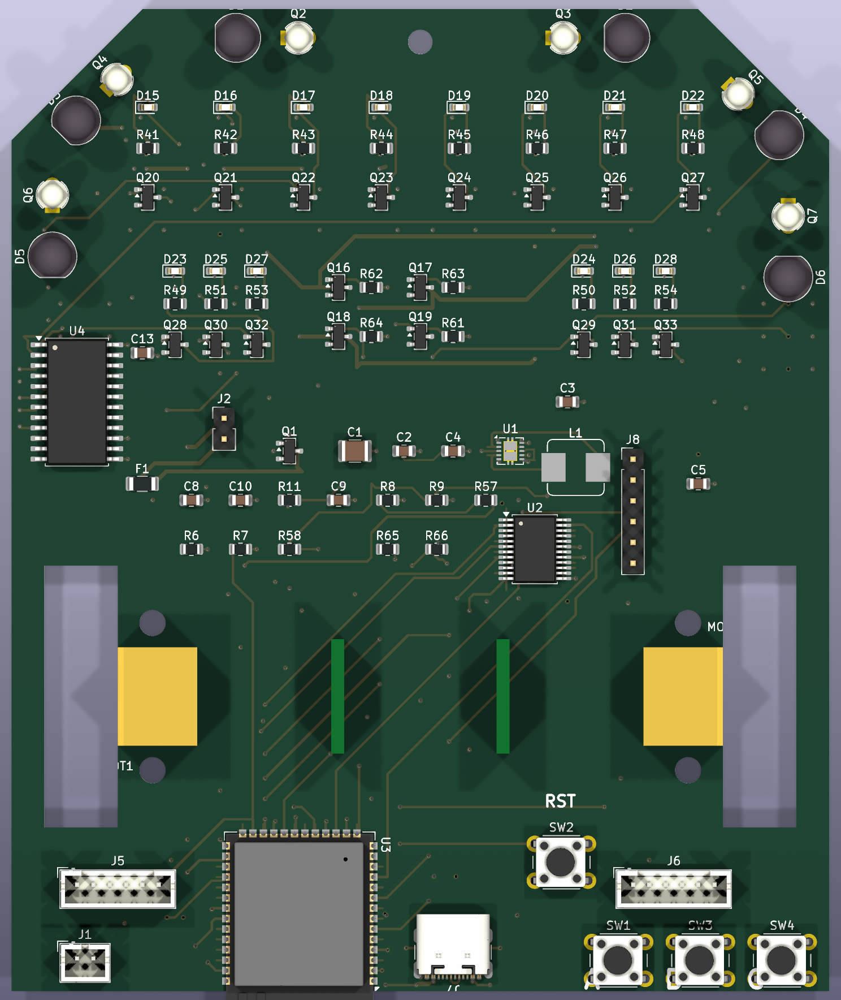

# Micromouse Runner

A competition-style micromouse robot on a custom **100 × 120 mm, 4-layer**
KiCad 10 PCB: ESP32-S3 module doing all control + wireless telemetry, a 2S
power tree with a regulated 6 V motor rail, a BNO055 9-axis IMU, research-
verified sensor geometry, and a fully script-generated, fully autorouted design.

> **Status (2026-07-19): in rev-7 remediation — NOT yet fab-ready.**
> ERC 0 · ratsnest 0 · **but 32 DRC *error*-severity violations** (front-cluster
> courtyard overlaps) that were masked for the whole project by
> `kicad-cli --severity-warning` (which hides errors on KiCad 10.0.4). The board
> is electrically manufacturable (0 copper/hole clearance errors). Formal status
> of every requirement + the remediation plan: **[`pcb/REQUIREMENTS.md`](pcb/REQUIREMENTS.md)**
> (IBM DOORS module). Verify with `pcb/tools/verify_drc.py`, never `--severity-warning`.



## The board (rev 6)

| Subsystem | Part | Notes |
|---|---|---|
| Controller | ESP32-S3-WROOM-1-N8R2 (bare module, dual-core FreeRTOS) | Rear placement; antenna spans a rear-edge U-notch (Espressif fallback), tip inside the board |
| Motor driver | TB6612FNG bare SSOP-24, **IN/IN PWM mode** | 6 V VM rail; PWMA/PWMB/STBY tied high, the four IN pins carry LEDC |
| **Power** | **2S LiPo** → **AP63203** (3.3 V/2 A logic) + **TPS54302** (regulated **6.0 V**/3 A motors) | Fuse (2.6 A/16 V PPTC), DMP3098L reverse P-FET (Vgs ±20 V), balance-tap per-cell monitoring |
| **Switches** | **SW5 = PWR ALL** (logic EN) + **SW6 = PWR MOTORS** (6 V rail EN) | Motors need both on; SW6's pull-up feeds from the SW5 node |
| **IMU** | **BNO055 9-axis** on the centerline, I2C (IO18/21), INT IO37 | Internal oscillator; gyro drives the yaw loop |
| Wall sensors | 6× IR333-A + PT334-6B pairs: front **0°**, diagonal **45.0°**, side **90.0°** | Exact aims with silk angle callouts; bent-body outlines fully inside the board (3–5 mm edge gap) |
| Line sensors | 8× Vishay TCRT5000, 9.525 mm QTR pitch, bottom face | Read through a CD74HC4067 mux (+ battery/VBUS telemetry on spare channels); walls go **direct to ADC1** |
| Indicators | Per-sensor LEDs on top for all 8 line + 6 wall channels | Wall LED ON = wall seen |
| User I/O | Buttons **A / B / C** (+ RST) lettered on silk; two power slides | A doubles as BOOT |
| USB | USB-C at the rear (flash/debug), ESD-protected, VBUS cable-detect | Direct D± (no series R, Espressif practice); 1×6 JTAG header |

All parts are orderable from **Lion Circuits** (verified In-Stock, 2026-07);
see [`pcb/STANDARDS.md`](pcb/STANDARDS.md) for the impedance / IPC / Espressif
compliance write-up.

Drive wheels run in open edge notches (wheel/tyre width unconstrained);
front castor hole at the nose. Chamfered nose for the diagonal sensor pair.

### 3D-printable motor bracket

Print two of the UKMARSBot **Pololu-pattern N20 bracket** (MIT licence):
[`pololu-gear-motor-bracket-standard.stl`](https://raw.githubusercontent.com/ukmars/ukmarsbot/master/mechanical/pololu-gear-motor-bracket-standard.stl)
(from [github.com/ukmars/ukmarsbot](https://github.com/ukmars/ukmarsbot),
`mechanical/`). The board is drilled for it: Ø3.2 mm NPTH pairs at 18.0 mm
centres — (17.25, 75)/(17.25, 93) and (82.75, 75)/(82.75, 93), axle at y = 84.
M2/M2.5/M3 screws from the underside into nuts captured by the bracket.

## Design rules & tooling

- 0.3 mm clearance against **every through-hole pin** on every verification
  path (hand-solder safety, structural in the router); SMD fields may relax
  to 0.16 mm where physics demands it.
- In1 = GND plane, In2 = 3V3 plane, partial VM battery pour on B.Cu; every
  SMD pour pad stitched by via + verified stub.
- Routed to **zero unrouted edges** by the project's own 4-layer A*
  autorouter (`route_loaded.py`): jailed-first ordering with immediate retry
  ladders, hand-computed bridges for the USB-C pad field, wide
  "verify-proof" retry rungs, and a convergent DRC heal loop
  (`heal_all.py`). The war stories live in `pcb/PROJECT_NOTES.md`.

## Repository layout

```
micromouse-runner/
├── pcb/            KiCad hardware design
│   ├── micromouse-pcb.kicad_sch / .kicad_pcb / .kicad_pro
│   ├── netlist.net
│   ├── CONNECTIONS.md      every net, every pin, and why (generated, coverage-enforced)
│   ├── PROJECT_NOTES.md    full design decision log, research, and known issues
│   ├── n20.pretty/         hand-authored exact N20 motor footprint + 3D model
│   └── tools/              generators (schematic + PCB are script-produced, so auditable)
│       ├── gen_sch.py / build_schematic.py     schematic generator
│       ├── gen_pcb.py / build_pcb.py           placement + in-house N-layer A* autorouter
│       ├── board_geom.py                       single source of mechanical truth
│       ├── route_loaded.py                     routing pipeline (run build_pcb.py first)
│       ├── heal_all.py                         convergent DRC-unconnected healer
│       └── gen_connections.py / verify_netlist.py   docs + connectivity checks
├── fw/             sample firmware + host simulation
│   ├── micromouse/     pins.h (netlist-gated) + control_core + .ino (line following)
│   ├── sim/            gcc host sim of the EXACT control core (scenarios asserted)
│   └── check_pins.py   gate: every firmware pin verified against the netlist
├── simulation/     maze-solving / motion simulation — planned
└── images/         renders
```

## Verification

- `pcb/TEST_REPORT.md` — **41** analytical circuit tests computed from the
  netlist (2S power tree, both bucks + the dual-switch enable logic, IN/IN
  motor drive, IMU I2C, mux telemetry, flashing/straps/JTAG, every IR chain),
  100 % net + component coverage. The harness **caught a real design bug**
  (the motor rail could never enable — R69's 1 MΩ source impedance sagged the
  EN divider; fixed).
- `pcb/STANDARDS.md` — impedance / IPC-2221B / IPC-2152 / grounding /
  Espressif antenna compliance, with numbers (USB-FS is not a
  controlled-impedance case; the 90 Ω rule is high-speed-only).
- `pcb/TRACE_REPORT.md` — trace-level copper analysis of the routed board:
  per-net path resistance, IR drops at operating currents, via ampacity, USB
  skew.
- `fw/sim/` — the shipped control core runs against board-derived physics;
  the sim caught two real control bugs before hardware. All scenarios pass.
- `pcb/CONNECTIONS.md` — the per-trace justification document: every net,
  every pin, and why (generated, coverage-enforced).

> **Connectivity note:** `kicad-cli pcb drc` under-reports unconnected items
> headless; the project gates on the **pcbnew ratsnest** (`GetUnconnectedCount`
> after a zone fill), and `finalize.py` refuses to strip copper unless that
> ratsnest is already zero.

## Ordering / fabrication

- `pcb/BOM.csv` — every row a verified MPN **In-Stock at Lion Circuits**
  (turnkey from Digi-Key/Mouser/Element14/Arrow/Avnet/RS). Power: AP63203WU-7,
  TPS54302DDCR, DMP3098L-7, MINISMDC260F/16-2, SRP4020TA-4R7M, EEE-FT1C221AP.
  IMU: BNO055. Optics: IR333-A + PT334-6B + TCRT5000. Connectors/switches:
  USB4105-GF-A, B2B-XH-A, PCM12SMTR, PTS645VL582LFS.
- `pcb/tools/export_fab.py` regenerates `pcb/fab/`: gerbers, Excellon drill
  (bracket/castor NPTH tools asserted present), placement CSV, and a fit-check
  STEP that loads **every** 3D model (project-local box-true models for the
  N20 motors, BNO055 and the SRP4020TA inductors).

## Build / regenerate

The PCB tooling runs from `pcb/` using the KiCad-bundled Python (`pcbnew`);
see `pcb/PROJECT_NOTES.md` for exact commands and the many hard-won
KiCad-format notes. Regeneration order: `build_schematic.py` → export
netlist → `verify_netlist.py` → `build_pcb.py` → `route_loaded.py` →
`heal_all.py` → `finalize.py` (silk→fab + ratsnest-gated stub cleanup) →
`sync_board_meta.py` (parity metadata) → `export_fab.py`.

## Status

**Rev 6.2 as-built → rev 7 in remediation.** Fully routed (ratsnest 0),
ERC 0, schematic-parity 0, electrically manufacturable (0 clearance errors),
2S power with a regulated 6 V motor rail, dual switches, BNO055 IMU, exact
0/45/90° wall-sensor aims, Lion-orderable BOM. **Not yet fab-ready:** 32
courtyard-convention DRC errors + three open frozen requirements (wall
indicators behind the sensors, GND poured on all layers, ESP32 local
decoupling). Full formal status and the remediation plan are in the IBM
DOORS-style module **[`pcb/REQUIREMENTS.md`](pcb/REQUIREMENTS.md)**.
