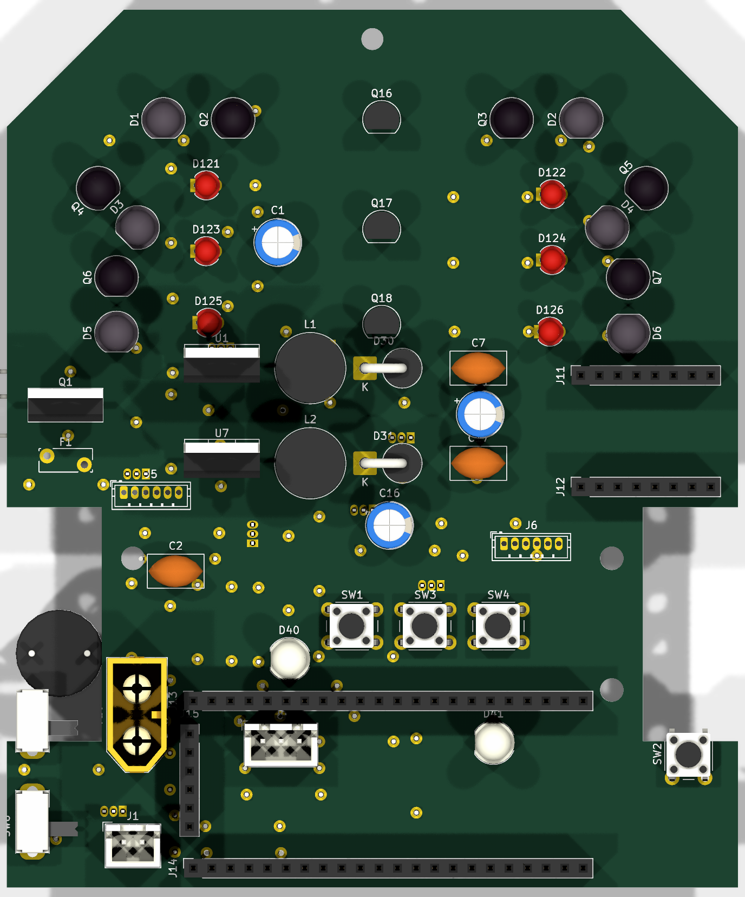
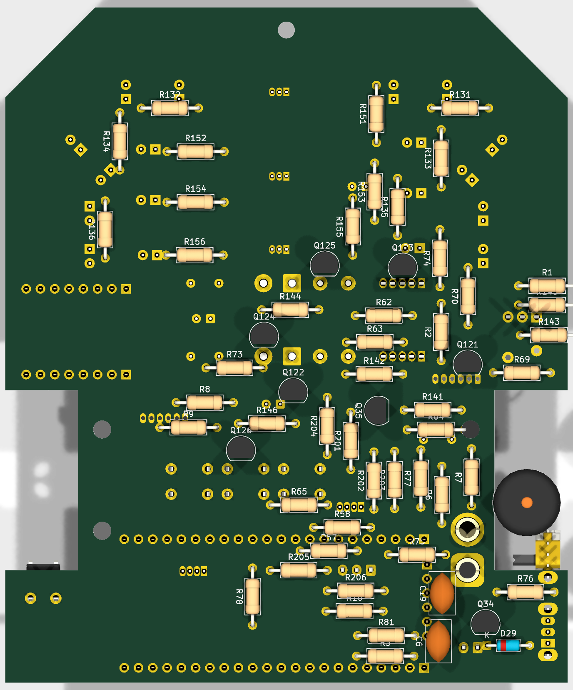

# THT Assembly — the self-solderable micromouse carrier board (KiCad project)

This folder is the **executable KiCad project** for the all-THT edition
chartered in [`../tht-variant/`](../tht-variant/) (BOM research, architecture
decisions, ordering flow live there — read it first).

**Everything here is script-generated**, same discipline as the SMD board:

```
tht-assembly/
├── pcb/
│   ├── micromouse-tht.kicad_sch / .kicad_pcb   generated outputs
│   ├── netlist.net                             schematic's own export
│   ├── n20.pretty/                             optic footprints (shared)
│   └── tools/
│       ├── build_schematic_tht.py   FULL schematic (198 syms, ERC 0,
│       │                            RAIL-only — no wire doglegs possible)
│       ├── build_pcb_tht.py         outline + placement (measured-courtyard
│       │                            greedy packers; 0 overlaps) + planes
│       ├── route_tht.py             A* routing (power 0.8mm, signals 0.4mm)
│       └── verify_drc.py …          the SMD project's gate suite, path-adapted
└── images/                          renders
```

## Key physical decisions (why the board looks like this)
- **Sensor geometry copied verbatim** from the rev-7.2 SMD board (D1-D6,
  Q2-Q7 wall optics at 0°/45°/90°, LS1-LS8 line array) — it is the
  research-verified core of the robot and all three families were already THT.
- **DevKitC-1 lies across the rear** on two 1×22 sockets (rows y94.5/117.36,
  USB end to the right, kept clear). The SMD board's antenna notch is gone —
  the DevKit's antenna rides ~10 mm above the board.
- **The mux DIP is soldered flat under the DevKit deck** (no socket — 4.3 mm
  under an 8.5 mm deck). Everything else under the deck is bare board.
- **Bottom face carries the silent majority**: all 66 axial resistors,
  20 TO-92 transistors, the flyback diode and the piezo — all under the
  ~7 mm ride-height budget. Top face keeps everything you look at or touch:
  optics, LEDs, buttons, connectors, power bricks, sockets.
- **Motor bays own the waist** (x2.7-46.2 / x53.8-97.3, y76.9-91.1 top): the
  only top-face items there are the wall-LED row and motor connectors at its
  forward edge.

## Assembly / bring-up
Follow [`../tht-variant/ORDERING.md`](../tht-variant/ORDERING.md) (bare-PCB
fab + parts kit + three robu modules). Solder bottom-face resistors first
(board flat), then work upward by height. Firmware: the shared `fw/` tree —
GPIO numbers are IDENTICAL to the SMD board (same S3 silicon); flash through
the DevKit's own USB-C.

## Placement (pre-routing, for review)

> These are PLACEMENT renders (no traces yet) — routing + DRC follow. Wall
> sensors sit on the perimeter facing outward with clear IR paths; indicators
> are inboard behind them; all support parts + both RGB drivers + the buzzer
> are on the bottom face.

**Top** — sensors (perimeter), indicators (inboard), power block, DevKit +
TB6612 sockets, buttons, RGB LEDs:



**Bottom** — axial resistors, TO-92 transistors, buzzer, flyback diode:



## Status
See the milestone log in git (`THT assembly M1..`): schematic ERC 0 →
placement 0-overlap + optical-clear → routing → DRC gate → fab package.
**Current: placement complete & optically verified; routing in progress.**
